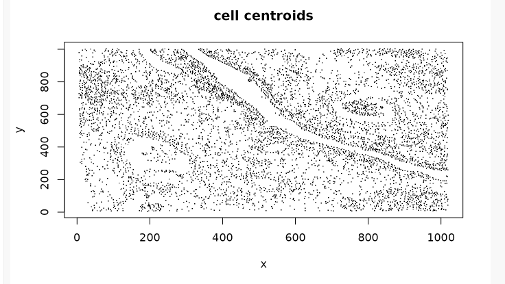
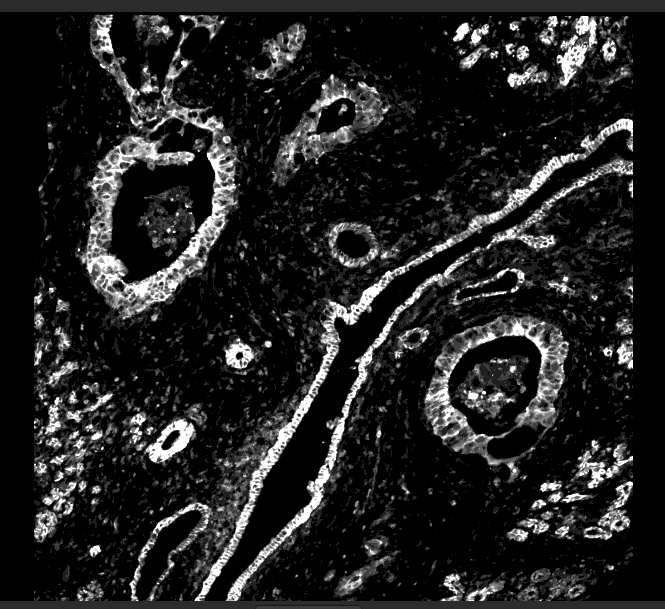
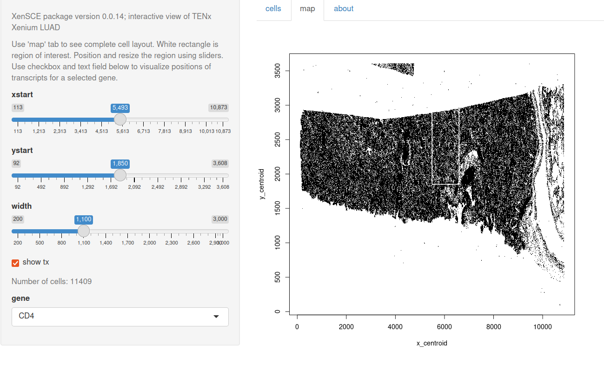
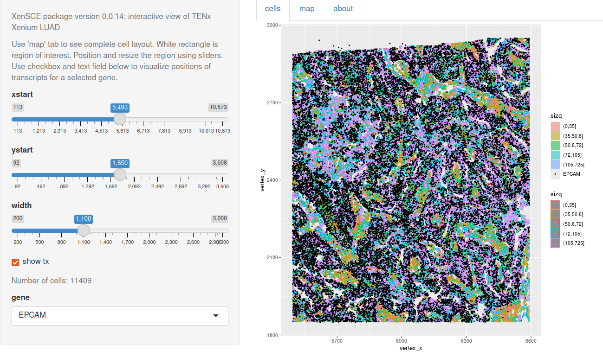
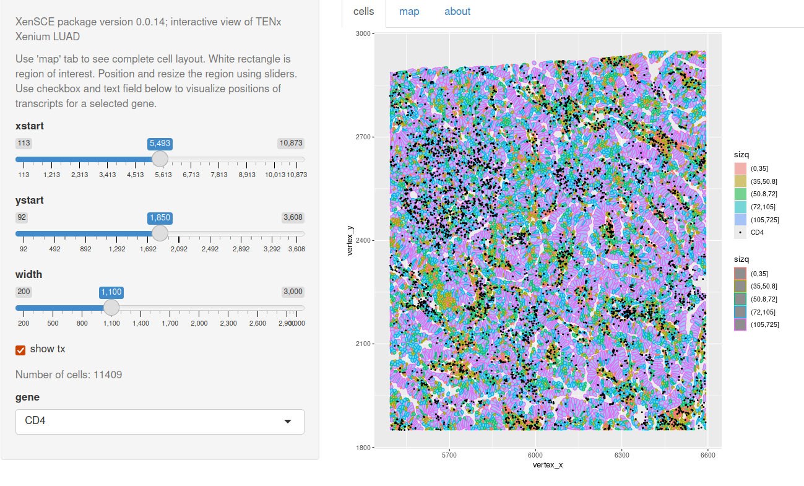

# XenSCE

This package experimentally explores an
S4 class and methods for 10x Xenium demonstration data in Open Storage Network.

## Installation
```
BiocManager::install("LTLA/ParquetDataFrame") # DelayedArray approach
BiocManager::install("vjcitn/XenSCE")
```

## Basics

The package

- defines a class `XenSCE` that extends SingleCellExperiment, accommodating
geometry information for cells, nuclei, and transcripts in ParquetDataFrame or DataFrame instances

- includes functions to retrieve example data from NSF Open Storage Network buckets

- includes a small example `panc_sub` derived from [SFEData](https://bioconductor.org/packages/SFEData/) XeniumOutput

A view of the `panc_sub` XenSCE:



Compare to the morphology_focus_0001.ome.tif found in the morphology_focus component of SFEData XeniumOutput




A [pkgdown site](https://vjcitn.github.io/XenSCE) is available.

## Interaction

A shiny app is available in inst/app3 of the sources.

The rectangle shows a region of interest, selectable using sliders:



The details can include positions of transcripts for selected genes:



CD4-expressing cells seem complementary to those expressing EPCAM.



An example is available at [shinyapps.io](https://vjcitn.shinyapps.io/XenLUAD).
