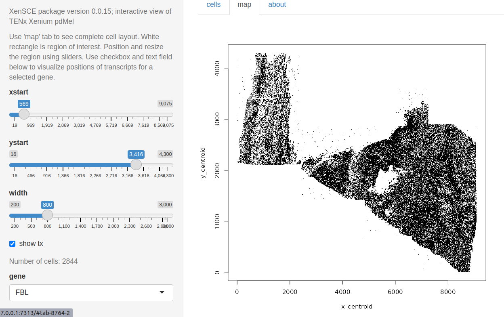
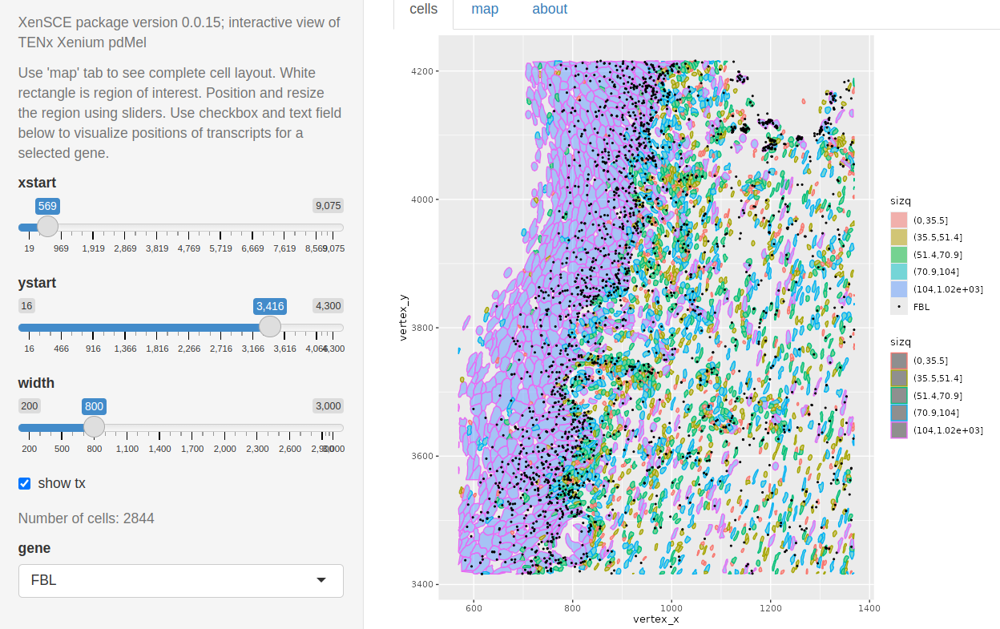

```{css style settings, echo = FALSE}
blockquote {
    padding: 10px 20px;
    margin: 0 0 20px;
    font-size: 14px;
    border-left: 5px solid #eee;
}
```

# Introduction

## Motivation

Numerous groups are working on methodology for analyzing
new data resources emerging from spatial transcriptomics experiments.
The "computing technology stack" necessary to work
with such data is complex.  The following
[comment](https://spatialdata.scverse.org/en/latest/tutorials/notebooks/notebooks/examples/models1.html)
(Aug 16 2024) from the scverse group is characteristic:

> The SpatialData Zarr format, which is described in our design doc, is an extension of the OME-NGFF specification, which makes use of the OME-Zarr, the AnnData Zarr and the Parquet file formats. We need to use these combination of technologies because currently OME-NGFF does not provide all the fundamentals required for storing spatial omics dataset; nevertheless, we try to stay as close as OME-NGFF as possible, and we are contributing to ultimately make spatial omics support available in pure OME-NGFF.

In Bioconductor 3.19, we might be committed to all these technologies (which 
include but do not mention HDF5) plus
R, reticulate, basilisk, and sf to have a widely functional solution.
Attaching the [Voyager](https://bioconductor.org/packages/Voyager) 
package leads to loading over 100 associated packages.
The XenSCE package is intended to explore the balance between functionality
and high dependency load specifically for the analysis of outputs
from 10x Xenium experiments.  The XenSCE class extends
[SpatialExperiment](https://bioconductor.org/packages/SpatialExperiment) to optionally
include references to parquet
files that manage voluminous geometry data; geometry can also be handled as DataFrame for sufficiently
low volume experiments.

As of 0.0.7 of XenSCE, a new class, XenSPEP, is provided to address
parquet representation of cell, nucleus and transcript coordinates.


## Data

This package is based on publicly available datasets.

- **Pancreas sample**.  Obtainable via `data(panc_sub)` this is derived from
`SpatialFeatureExperiment::readXenium(SFEData::XeniumOutput("v2"))`
but the assay has been replaced with an equivalent dgCMatrix instance, and
the geometry data are provided as thin DataFrame instances (thin meaning
each coordinate has a separate row), whereas the SpatialFeatureExperiment
uses simple features to organize geometry information on cells, nuclei,
and transcripts.

- **Human brain** [FFPE Glioblastoma Data](https://www.10xgenomics.com/datasets/ffpe-human-brain-cancer-data-with-human-immuno-oncology-profiling-panel-and-custom-add-on-1-standard).  We have taken several components of the distribution
and placed them in an NSF Open Storage Network bucket.  The `cache_assets` function in this package will download
and cache about 4GB of compressed sparse matrix and parquet
data files; it returns the paths to these
resources.  The `build_demo` function creates an instance
of `XenSCE`.  


- **Human lung (SFE-based)** [FFPE Lung cancer dataset](https://www.10xgenomics.com/datasets/preview-data-ffpe-human-lung-cancer-with-xenium-multimodal-cell-segmentation-1-standard).  We used scripts distributed by scverse to create a zarr-based representation, and
used `readXenium` on the 10x distribution.  Use `example(sfe2xsce)` to retrieve and cache and transform
the SpatialFeatureExperiment to a XenSCE instance.

- **Human dermal melanoma** [FFPE Human pan tissue dataset](https://www.10xgenomics.com/datasets/xenium-prime-ffpe-human-skin).  For this dataset, we
retrieved the `outs.zip` file from this site and ran `XenSCE::ingest_xen`
on the contents, producing a XenSPEP instance which was then saved
in an HDF5-backed representation.  This, along with the parquet
files for cell, nucleus, and transcript coordinates, are zipped together
and placed in an Open Storage Network bucket for retrieval via
`cache_xen_sk`.

- **Human prostate adenocarcinoma** [FFPE Human pan tissue dataset](https://www.10xgenomics.com/datasets/xenium-prime-ffpe-human-prostate).  For this dataset, we
retrieved the `outs.zip` file from this site and ran `XenSCE::ingest_xen`
on the contents, producing a XenSPEP instance which was then saved
in an HDF5-backed representation.  This, along with the parquet
files for cell, nucleus, and transcript coordinates, are zipped together
and placed in an Open Storage Network bucket for retrieval via
`cache_xen_prost`.

- **Human Lung (SPEP example)** Again working with [FFPE Lung cancer preview](https://www.10xgenomics.com/datasets/preview-data-ffpe-human-lung-cancer-with-xenium-multimodal-cell-segmentation-1-standard), but working with `ingest_xen`
and `zipXenSPEP` to produce a portable archive.  Use `example(cache_xen_luad)` to obtain this instance of XenSPEP.

## A quick look

### Small in-memory example

Boundary coordinates are in memory, in S4Vector::DataFrame instances.

```{r dolit, fig.width=6, fig.height=6}
library(XenSCE)
data(panc_sub)
panc_sub
plot(SpatialExperiment::spatialCoords(panc_sub), 
   pch="." , cex=1.5, xlab="x", ylab="y", main="cell centroids")
```

### Larger hybrid example

In this example, transcript counts are in memory
in a sparse matrix, but geometry information is
handled in parquet.  The `view_seg_g2` function
allows selection of two gene symbols, and
cells are colored according to single or double
occupancy.

```{r dolung, fig.width=7, fig.height=7,message=FALSE}
luad = cache_xen_luad()
pa = cache_xen_luad()
luad = restoreZipXenSPEP(pa)
rownames(luad) = make.names(SummarizedExperiment:::rowData(luad)$Symbol, unique=TRUE)
out = view_seg_g2(luad, c(5800, 6300), c(1300, 1800), lwd=.5, gene1="CD4", gene2="EPCAM")
legend(5800,1390, fill=c("purple", "cyan", "pink"), legend=c("CD4", "EPCAM", "both"))
out$ncells
```

### Interactivity

In `inst/app4`, code is provided to work with the primary dermal melanoma
dataset.  A map of the cell coordinates can drive focused exploration.  The
region of interest is shown by a whitened rectangle in the upper left corner.



Cells are colored by quintile of size.  Points where FBL transcripts
are found are plotted as dots.



More work is needed to identify useful exploratory visualizations.

### Large disk-based example

#### HDF5+parquet-backed examples

We want to be able to accommodate very large numbers of
cells and transcripts without heavy infrastructure
commitments.  Examples with the XenSPEP class illustrate
the current approach.

We'll use the prostate adenocarcinoma 5K dataset to demonstrate.
A 900MB zip file will be cached.
```{r doprost1}
prost = cache_xen_prost()
```
`prost` is the path to a zip file in a BiocFileCache instance.

Create a folder to work in, and unzip.
```{r doprost2}
dir.create(xpw <- file.path(tempdir(), "prost_work"))
unzip(prost, exdir=xpw)
dir(xpw)
```

Restore the SpatialExperiment component.
```{r doprost3}
prostx = HDF5Array::loadHDF5SummarizedExperiment(file.path(xpw, "xen_prost"))
prostx
```

#### Approaching obsolescence: GBM
If you are interested in working with the 10X GBM data, use the following:
```{r do1, message=FALSE, eval=FALSE}
library(XenSCE)
myxen = retrieve_demo() # steps noted above were done
myxen
```

To sample the cell centroid coordinates and plot, use:

```{r do2,fig.height=4, fig.width=4, eval=FALSE}
set.seed(1234)
sinds = sort(sample(seq_len(ncol(myxen)), 5000))
plot(myxen$x_centroid[sinds], -myxen$y_centroid[sinds],
  xlab="x", ylab="y", main="Sample of 5000 centroids", pty="s")
```

Compare the basic layout to the 'summary' visualization
shipped with the data.


## Clipping and visualizing

`clip_rect` is an endomorphism that restricts the cells in an XenSCE instance
to those with centroids in given boundaries in x and y.
By default, cell centroid and transcript locations are added.
AT PRESENT (0.0.15) THIS ONLY WORKS FOR IN-MEMORY/NON-PARQUET-BASED ExAMPLES.


```{r dosimpa,fig.height=6, fig.width=6}
plotCellBoundaries(clip_rect(panc_sub, xlim=c(600,850), ylim=c(500,750)), add_tx=FALSE)
```

With transcript locations:

```{r dosimp,fig.height=6, fig.width=6}
plotCellBoundaries(clip_rect(panc_sub, xlim=c(600,850), ylim=c(500,750)))
```

