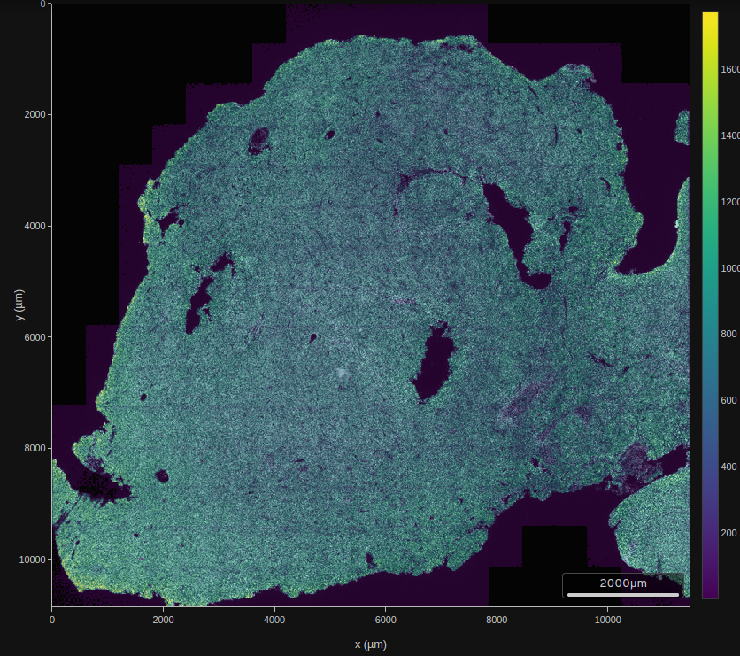

# Introduction

This package is based on a dataset distributed by TENx genomics
as [Human FFPE Brain Cancer Data](https://www.10xgenomics.com/datasets/ffpe-human-brain-cancer-data-with-human-immuno-oncology-profiling-panel-and-custom-add-on-1-standard).  We have taken several components of the distribution
and placed them in an NSF Open Storage Network bucket.

A basic concern is to acquire the data for local computation.
The `cache_assets` function in this package will download
and cache about 4GB of compressed sparse matrix and parquet
data files; it returns the paths to these
resources.  The `build_demo` function creates an instance
of `XenSCE`.  This class extends [SingleCellExperiment](https://bioconductor.org/packages/SingleCellExperiment) to include references to parquet
files that manage voluminous geometry data.

## Data retrieval and caching

Use `cache_assets()` to retrieve data from the web.  Use
`x = build_demo()` to produce `x`, an instance of `XenSCE`.
Use `cache_demo(x)` to save this in cache, and
`y = retrieve_demo()` to restore the cached image
in `y`.  Once this cycle has been completed, `retrieve_demo`
can be used in any session to obtain the instance.

## A quick look

### Small in-memory example

```{r dolit, fig.width=6, fig.height=6}
library(XenSCE)
data(panc_sub)
panc_sub
plot(panc_sub$x_centroid, panc_sub$y_centroid, pch="." , cex=1.5, xlab="x", ylab="y", main="cell centroids")
```

### Large disk-based example
If you are interested in working with the 10X GBM data, use the following:
```{r do1, message=FALSE, eval=FALSE}
library(XenSCE)
myxen = retrieve_demo() # steps noted above were done
myxen
```

To sample the cell centroid coordinates and plot, use:

```{r do2,fig.height=4, fig.width=4, eval=FALSE}
set.seed(1234)
sinds = sort(sample(seq_len(ncol(myxen)), 5000))
plot(myxen$x_centroid[sinds], -myxen$y_centroid[sinds],
  xlab="x", ylab="y", main="Sample of 5000 centroids", pty="s")
```

Compare the basic layout to the 'summary' visualization
shipped with the data.



## Clipping and visualizing

`clip_rect` is an endomorphism that restricts the cells in an XenSCE instance
to those with centroids in given boundaries in x and y.
By default, cell centroid and transcript locations are added.


```{r dosimpa,fig.height=6, fig.width=6}
plotCellBoundaries(clip_rect(panc_sub, xlim=c(600,850), ylim=c(500,750)), add_tx=FALSE)
```

With transcript locations:

```{r dosimp,fig.height=6, fig.width=6}
plotCellBoundaries(clip_rect(panc_sub, xlim=c(600,850), ylim=c(500,750)))
```

